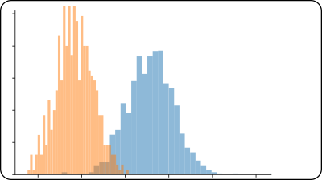

<!-- # flags -->
<!-- - 'published' : Publication -->
<!-- - 'preprint'  : Preprint -->


## Published 

### 2023

```{=html}
<ul class='list-group list-group-flush'><li class='list-group-item'><b>Bayesian Optimal Two-sample Tests for High-dimensional Gaussian Populations</b><br> Kyoungjae Lee, <strong>KY</strong>, and Lizhen Lin. <br> <em>Bayesian Analysis</em>.<br><a class="btn btn-outline-dark btn-sm", href="https://doi.org/10.48550/arXiv.2112.02580" target="_blank" rel="noopener noreferrer">
        <i class="bi bi-file-earmark-pdf" role='img' aria-label='arXiv'></i>
        arXiv
    </a> <a class="btn btn-outline-dark btn-sm", href="https://doi.org/10.1214/23-BA1373" target="_blank" rel="noopener noreferrer">
        <i class="ai ai-archive" role='img' aria-label='Publisher's Site'></i>
        Publisher's Site
    </a></li></ul>
```

### 2022

```{=html}
<ul class='list-group list-group-flush'><li class='list-group-item'><b>Network Distance Based on Laplacian Flows on Graphs</b><br> Dianbin Bao, <strong>KY</strong>, and Lizhen Lin. <br> <em>IEEE International Conference on Big Data (Big Data)</em>.<br><a class="btn btn-outline-dark btn-sm", href="https://doi.org/10.48550/arXiv.1810.02906" target="_blank" rel="noopener noreferrer">
        <i class="bi bi-file-earmark-pdf" role='img' aria-label='arXiv'></i>
        arXiv
    </a> <a class="btn btn-outline-dark btn-sm", href="https://github.com/kisungyou/NetworkDistance" target="_blank" rel="noopener noreferrer">
        <i class="bi bi-github" role='img' aria-label='Code'></i>
        Code
    </a> <a class="btn btn-outline-dark btn-sm", href="https://doi.org/10.1109/BigData55660.2022.10020500" target="_blank" rel="noopener noreferrer">
        <i class="ai ai-archive" role='img' aria-label='Publisher's Site'></i>
        Publisher's Site
    </a></li>
<li class='list-group-item'><b>Geometric learning of functional brain network on the correlation manifold</b><br> <strong>KY</strong> and Hae-Jeong Park. <br> <em>Scientific Reports</em>.<br><a class="btn btn-outline-dark btn-sm", href="https://github.com/kisungyou/papers/tree/master/02_CORRbox" target="_blank" rel="noopener noreferrer">
        <i class="bi bi-github" role='img' aria-label='Code'></i>
        Code
    </a> <a class="btn btn-outline-dark btn-sm", href="https://www.nature.com/articles/s41598-022-21376-0" target="_blank" rel="noopener noreferrer">
        <i class="ai ai-archive" role='img' aria-label='Publisher's Site'></i>
        Publisher's Site
    </a></li>
<li class='list-group-item'><b>Parameter estimation and model-based clustering with spherical normal distribution on the unit hypersphere</b><br> <strong>KY</strong> and Changhee Suh. <br> <em>Computational Statistics & Data Analysis</em>.<br><a class="btn btn-outline-dark btn-sm", href="https://doi.org/10.48550/arXiv.2106.06375" target="_blank" rel="noopener noreferrer">
        <i class="bi bi-file-earmark-pdf" role='img' aria-label='arXiv'></i>
        arXiv
    </a> <a class="btn btn-outline-dark btn-sm", href="https://kisungyou.com/Riemann" target="_blank" rel="noopener noreferrer">
        <i class="bi bi-github" role='img' aria-label='Code'></i>
        Code
    </a> <a class="btn btn-outline-dark btn-sm", href="https://doi.org/10.1016/j.csda.2022.107457" target="_blank" rel="noopener noreferrer">
        <i class="ai ai-archive" role='img' aria-label='Publisher's Site'></i>
        Publisher's Site
    </a></li>
<li class='list-group-item'><b> Learning Subspaces of Different Dimensions</b><br> Brian St. Thomas, <strong>KY</strong>, Lizhen Lin, Lek-Heng Lim, and Sayan Mukherjee. <br> <em>Journal of Computational and Graphical Statistics</em>.<br><a class="btn btn-outline-dark btn-sm", href="https://doi.org/10.48550/arXiv.1404.6841" target="_blank" rel="noopener noreferrer">
        <i class="bi bi-file-earmark-pdf" role='img' aria-label='arXiv'></i>
        arXiv
    </a> <a class="btn btn-outline-dark btn-sm", href="https://kisungyou.com/T4cluster" target="_blank" rel="noopener noreferrer">
        <i class="bi bi-github" role='img' aria-label='Code'></i>
        Code
    </a> <a class="btn btn-outline-dark btn-sm", href="https://doi.org/10.1080/10618600.2021.2000420" target="_blank" rel="noopener noreferrer">
        <i class="ai ai-archive" role='img' aria-label='Publisher's Site'></i>
        Publisher's Site
    </a></li>
<li class='list-group-item'><b>Rdimtools: An R package for Dimension Reduction and Intrinsic Dimension Estimation</b><br> <strong>KY</strong> and Dennis Shung. <br> <em>Software Impacts</em>.<br><a class="btn btn-outline-dark btn-sm", href="https://doi.org/10.48550/arXiv.2005.11107" target="_blank" rel="noopener noreferrer">
        <i class="bi bi-file-earmark-pdf" role='img' aria-label='arXiv'></i>
        arXiv
    </a> <a class="btn btn-outline-dark btn-sm", href="https://github.com/kisungyou/Rdimtools" target="_blank" rel="noopener noreferrer">
        <i class="bi bi-github" role='img' aria-label='Code'></i>
        Code
    </a> <a class="btn btn-outline-dark btn-sm", href="https://doi.org/10.1016/j.simpa.2022.100414" target="_blank" rel="noopener noreferrer">
        <i class="ai ai-archive" role='img' aria-label='Publisher's Site'></i>
        Publisher's Site
    </a></li></ul>
```

### 2021

```{=html}
<ul class='list-group list-group-flush'><li class='list-group-item'><b>Re-visiting Riemannian geometry of symmetric positive definite matrices for the analysis of functional connectivity</b><br> <strong>KY</strong> and Hae-Jeong Park. <br> <em>NeuroImage</em>.<br><a class="btn btn-outline-dark btn-sm", href="https://github.com/kisungyou/papers/tree/master/01_SPDtoolbox" target="_blank" rel="noopener noreferrer">
        <i class="bi bi-github" role='img' aria-label='Code'></i>
        Code
    </a> <a class="btn btn-outline-dark btn-sm", href="https://doi.org/10.1016/j.neuroimage.2020.117464" target="_blank" rel="noopener noreferrer">
        <i class="ai ai-archive" role='img' aria-label='Publisher's Site'></i>
        Publisher's Site
    </a></li></ul>
```

### 2020

```{=html}
<ul class='list-group list-group-flush'><li class='list-group-item'><b>Data transforming augmentation for heteroscedastic models</b><br> Hyungsuk Tak, <strong>KY</strong>, Sujit K. Ghosh, Bingyue Su, and Joseph Kelly. <br> <em>Journal of Computational and Graphical Statistics</em>.<br><a class="btn btn-outline-dark btn-sm", href="https://doi.org/10.48550/arXiv.1911.02748" target="_blank" rel="noopener noreferrer">
        <i class="bi bi-file-earmark-pdf" role='img' aria-label='arXiv'></i>
        arXiv
    </a> <a class="btn btn-outline-dark btn-sm", href="https://doi.org/10.1080/10618600.2019.1704295" target="_blank" rel="noopener noreferrer">
        <i class="ai ai-archive" role='img' aria-label='Publisher's Site'></i>
        Publisher's Site
    </a></li></ul>
```

### 2019

```{=html}
<ul class='list-group list-group-flush'><li class='list-group-item'><b>Volume change pattern of decompression of mandibular odontogenic keratocyst</b><br> Jin Hoo Park, Eun-Jung Kwak, <strong>KY</strong>, Young-Soo Jung, and Hwi-Dong Jung. <br> <em>Maxillofacial Plastic and Reconstructive Surgery</em>.<br><a class="btn btn-outline-dark btn-sm", href="https://doi.org/10.1186/s40902-018-0184-y" target="_blank" rel="noopener noreferrer">
        <i class="ai ai-archive" role='img' aria-label='Publisher's Site'></i>
        Publisher's Site
    </a></li></ul>
```

### 2016

```{=html}
<ul class='list-group list-group-flush'><li class='list-group-item'><b>Vision-based detection of loosened bolts using the Hough transform and support vector machines</b><br> Young-Jin Cha, <strong>KY</strong>, and Wooram Choi. <br> <em>Automation in Construction</em>.<br><a class="btn btn-outline-dark btn-sm", href="https://doi.org/10.1016/j.autcon.2016.06.008" target="_blank" rel="noopener noreferrer">
        <i class="ai ai-archive" role='img' aria-label='Publisher's Site'></i>
        Publisher's Site
    </a></li></ul>
```


## Preprint


```{=html}
<ul class='list-group list-group-flush'><li class='list-group-item'><b>On the spherical Laplace distribution</b><br> <strong>KY</strong> and Dennis Shung (2022).<br><a class="btn btn-outline-dark btn-sm", href="https://doi.org/10.48550/arXiv.2208.11929" target="_blank" rel="noopener noreferrer">
        <i class="bi bi-file-earmark-pdf" role='img' aria-label='arXiv'></i>
        arXiv
    </a></li>
<li class='list-group-item'><b>On the Wasserstein median of probability measures</b><br> <strong>KY</strong> and Dennis Shung (2022).<br><a class="btn btn-outline-dark btn-sm", href="https://doi.org/10.48550/arXiv.2209.03318" target="_blank" rel="noopener noreferrer">
        <i class="bi bi-file-earmark-pdf" role='img' aria-label='arXiv'></i>
        arXiv
    </a></li>
<li class='list-group-item'><b>Comparing multiple latent space embeddings using topological analysis</b><br> <strong>KY</strong>, Ilmun Kim, Ick Hoon Jin, Minjeong Jeon, and Dennis Shung (2022).<br><a class="btn btn-outline-dark btn-sm", href="https://doi.org/10.48550/arXiv.2208.12435" target="_blank" rel="noopener noreferrer">
        <i class="bi bi-file-earmark-pdf" role='img' aria-label='arXiv'></i>
        arXiv
    </a> <a class="btn btn-outline-dark btn-sm", href="https://github.com/kisungyou/papers/tree/master/03_TopLSM" target="_blank" rel="noopener noreferrer">
        <i class="bi bi-github" role='img' aria-label='Code'></i>
        Code
    </a></li></ul>
```

```{=html}
<ul class='list-group list-group-flush'><li class='list-group-item'><b>Shape-Preserving Dimensionality Reduction : An Algorithm and Measures of Topological Equivalence</b><br> Byeongsu Yu and <strong>KY</strong> (2021).<br><a class="btn btn-outline-dark btn-sm", href="https://doi.org/10.48550/arXiv.2106.02096" target="_blank" rel="noopener noreferrer">
        <i class="bi bi-file-earmark-pdf" role='img' aria-label='arXiv'></i>
        arXiv
    </a></li></ul>
```


<!-- ## manual test -->

<!-- ```{python} -->
<!-- #| label: "manual-test" -->
<!-- #| id: "manual-test" -->
<!-- #| output: asis -->
<!-- display(HTML( -->
<!--   '<div class="container">'+ -->
<!--   '<div class="row"><div class="col-md-3"></div>'+ -->
<!--   '<div class="col-md-6"><div class="description"><b>Benchmarking Generative Latent Variable Models for Speech</b> <br>Jakob Drachmann Havtorn, Lasse Borgholt, Søren Hauberg, Jes Frellsen and Lars Maaløe.<br>Deep Generative Models for Highly Structured Data (ICLR 2022 Workshop).<br><a class="btn btn-default" href="benchmark2022/benchmarking_generative_latent.pdf">PDF</a><a class="btn btn-default" href="https://openreview.net/forum?id=SEe-shVOPbc">OpenReview</a></div></div> <!-- col-md-6 --></div> <!-- row --> </div>')) -->
<!-- ``` -->

